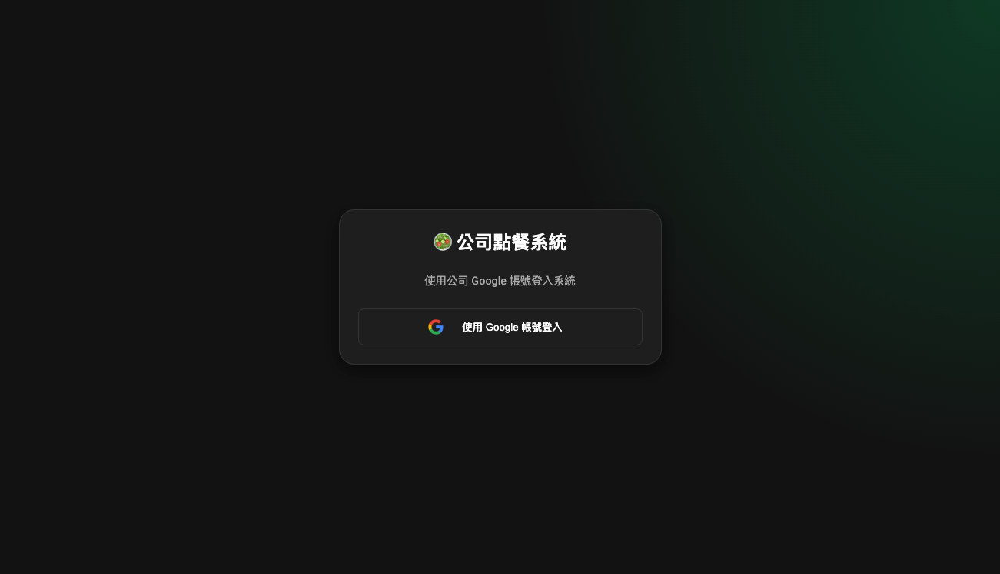
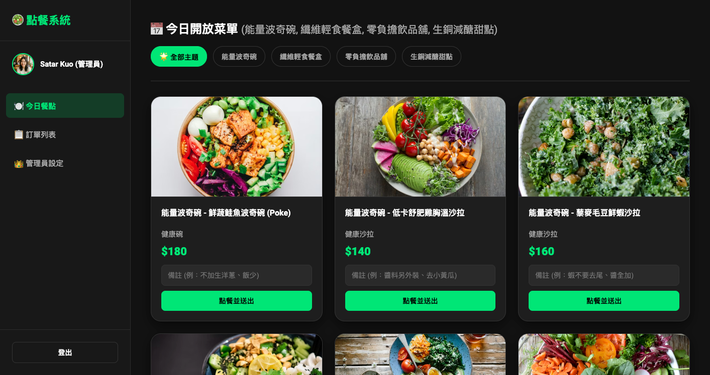
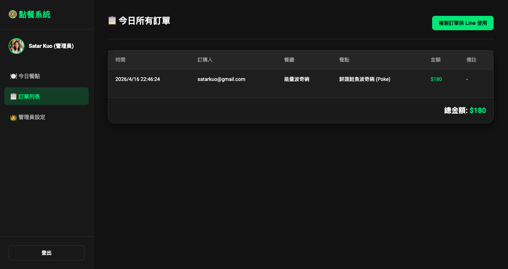
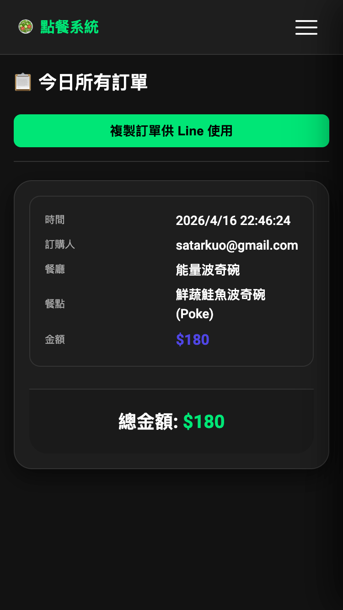
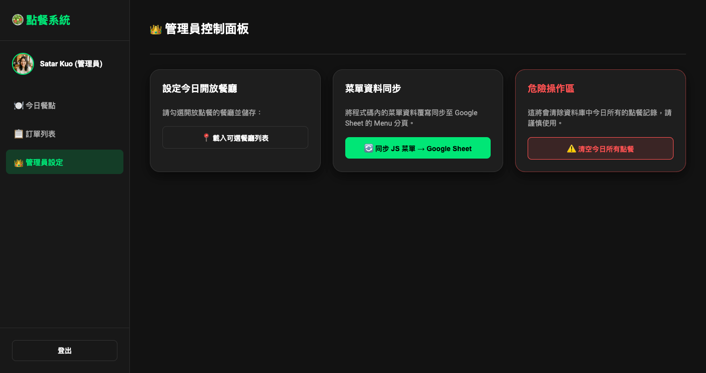

# 🥗 公司內部點餐工具

一套基於純前端（HTML / CSS / JavaScript）打造的公司內部點餐系統，透過 **Google Identity Services** 進行身份驗證，並使用 **Google Sheets API** 作為資料庫，不需要後端伺服器即可運行。

---

## 📋 目錄

- [功能總覽](#功能總覽)
- [技術架構](#技術架構)
- [Google Sheet 結構](#google-sheet-結構)
- [環境設定](#環境設定)
- [畫面介紹](#畫面介紹)
  - [登入頁](#登入頁)
  - [今日菜單](#今日菜單)
  - [訂單列表](#訂單列表)
  - [管理員控制面板](#管理員控制面板)
- [使用流程](#使用流程)
- [注意事項](#注意事項)

---

## 功能總覽

| 功能 | 說明 |
|------|------|
| Google 帳號登入 | 使用公司 Google 帳號進行 OAuth 2.0 驗證 |
| 權限管控 | 從 `Users` 分頁判斷一般成員 / 管理員身份 |
| 今日菜單 | 依管理員設定顯示當日開放餐廳與餐點，支援分頁過濾 |
| 快速點餐 | 填寫備註後一鍵送出，直接寫入 Google Sheet |
| 訂單列表 | 即時讀取 Google Sheet 中所有訂單，顯示總金額 |
| 複製訂單 | 一鍵將訂單格式化後複製到剪貼簿，可直接貼到 Line |
| 管理員設定 | 設定當日開放餐廳；清空訂單；同步 JS 菜單到 Google Sheet |
| 手機版支援 | 響應式設計，訂單列表在手機版自動切換為卡片式排版 |
| Token 快取 | Access Token 存入 LocalStorage，一小時內自動登入 |

---

## 技術架構

```
前端
├── index.html          主頁面 HTML 結構
├── all.css             全域樣式（響應式）
└── all.js              核心邏輯（Google API、點餐、管理員功能）

外部依賴（CDN）
├── Google Identity Services  (accounts.google.com/gsi/client)
└── Google API Client         (apis.google.com/js/api.js)

資料儲存
└── Google Sheets（免費、無後端）
```

---

## Google Sheet 結構

請在同一份 Google Sheet 中建立以下 **4 個分頁**：

### `Users` — 授權名單
| A 欄（姓名） | B 欄（Email） | C 欄（權限） |
|---|---|---|
| 王小明 | ming@company.com | 管理員 |
| 陳小華 | hua@company.com | 一般成員 |

### `TodayConfig` — 今日開放餐廳
| A 欄（餐廳名稱） |
|---|
| 能量波奇碗 |
| 零負擔飲品舖 |

> 第一列為標題列，資料從第二列開始。管理員可透過控制面板動態設定。

### `Orders` — 訂單記錄
| A（時間） | B（Email） | C（餐廳） | D（餐點） | E（金額） | F（備註） |
|---|---|---|---|---|---|
| 2026/4/16 12:05 | ming@company.com | 能量波奇碗 | 鮮蔬鮭魚波奇碗 | 180 | 不加洋蔥 |

### `Menu` — 菜單資料
| restaurant | name | price | category | img | hint |
|---|---|---|---|---|---|
| 能量波奇碗 | 鮮蔬鮭魚波奇碗 (Poke) | 180 | 健康碗 | https://... | 例：不加生洋蔥 |

> 此分頁可透過管理員控制面板的「🔄 同步 JS 菜單」功能自動寫入。

---

## 環境設定

### 1. 建立 GCP 專案並取得 Client ID

1. 前往 [Google Cloud Console](https://console.cloud.google.com/)
2. 建立新專案
3. 啟用以下 API：
   - **Google Sheets API**
   - **Google Identity Services**
4. 在「憑證」中建立 **OAuth 2.0 用戶端 ID**（應用程式類型選「網頁應用程式」）
5. 加入授權的 JavaScript 來源（例如 `http://localhost:3000` 或正式網域）
6. 複製 **用戶端 ID**

### 2. 建立 Google Sheet

按照上方「Google Sheet 結構」建立 4 個分頁，並取得試算表網址中的 **Sheet ID**：

```
https://docs.google.com/spreadsheets/d/【這段就是 SPREADSHEET_ID】/edit
```

### 3. 填入設定

開啟 `all.js`，修改頂部的 `CONFIG` 物件：

```javascript
const CONFIG = {
  CLIENT_ID: "你的 GCP 用戶端 ID.apps.googleusercontent.com",
  SPREADSHEET_ID: "你的 Google Sheet ID",
  // 以下不需修改
  DISCOVERY_DOC: "https://sheets.googleapis.com/$discovery/rest?version=v4",
  SCOPES: "https://www.googleapis.com/auth/spreadsheets ...",
};
```

### 4. 部署

本專案為純靜態前端，可直接部署至：
- **GitHub Pages**
- **Netlify / Vercel**
- 公司內部靜態檔案伺服器

> ⚠️ 請勿直接用 `file://` 開啟，必須透過 HTTP(S) 伺服器，Google OAuth 才能正常運作。

---

## 畫面介紹

### 登入頁

使用者進入系統後，看到的第一個畫面。點擊「使用 Google 帳號登入」按鈕後，會彈出 Google OAuth 授權視窗。

> 📷 **截圖請替換此處**
> 截圖路徑：`screenshots/01-login.png`



登入流程：
1. 點擊登入按鈕 → 彈出 Google 帳號選擇視窗
2. 系統驗證帳號是否在 `Users` 分頁的授權名單中
3. 驗證通過後進入主畫面，1 小時內再次開啟可自動登入

---

### 今日菜單

登入後的預設首頁。顯示管理員設定的當日開放餐廳與餐點卡片。

> 📷 **截圖請替換此處**
> 截圖路徑：`screenshots/02-menu.png`



功能說明：
- 頂部 Tab 列可切換「全部主題」或指定餐廳
- 每張餐點卡片顯示：圖片、餐廳、餐點名稱、分類、價格
- 備註欄位可輸入客製化需求（例：不加蔥、飯減半）
- 點擊「點餐並送出」即寫入 Google Sheet `Orders` 分頁

---

### 訂單列表

顯示今日所有人的點餐記錄，並計算總金額。

**桌機版**（寬度 > 768px）顯示表格：

> 📷 **截圖請替換此處**
> 截圖路徑：`screenshots/03-orders-desktop.png`



**手機版**（寬度 ≤ 768px）自動切換為卡片式排版，避免水平捲軸：

> 📷 **截圖請替換此處**
> 截圖路徑：`screenshots/03-orders-mobile.png`



功能說明：
- 即時從 Google Sheet `Orders` 分頁讀取資料
- 右上角「複製訂單供 Line 使用」可將訂單格式化後複製到剪貼簿

複製後格式範例：
```
📋 今日點餐清單：

[能量波奇碗] 鮮蔬鮭魚波奇碗 (Poke) $180 - ming@company.com (不加洋蔥)
[纖維輕食餐盒] 糙米鯖魚高纖便當 $135 - hua@company.com

💰 總金額：315 元
```

---

### 管理員控制面板

僅限 `Users` 分頁中權限為「管理員」的帳號可見。

> 📷 **截圖請替換此處**
> 截圖路徑：`screenshots/04-admin.png`



功能說明：

| 功能 | 說明 |
|------|------|
| 設定今日開放餐廳 | 從所有餐廳中勾選當日要開放的餐廳，儲存後即時生效 |
| 同步 JS 菜單 → Google Sheet | 將 `all.js` 中的菜單資料覆寫至 Sheet `Menu` 分頁 |
| 清空今日所有點餐 | 清除 `Orders` 分頁中 A2 以下所有資料（保留標題列） |

---

## 使用流程

### 一般成員

```
開啟網頁
  → Google 帳號登入
  → 瀏覽今日菜單
  → 填寫備註（可選）
  → 點擊「點餐並送出」
  → 完成 ✅
```

### 管理員

```
每日開始前：
  → 登入後進入「管理員控制面板」
  → 點擊「載入可選餐廳列表」
  → 勾選今日開放的餐廳
  → 點擊「送出並儲存設定」

收單後：
  → 進入「訂單列表」確認所有訂單
  → 點擊「複製訂單供 Line 使用」
  → 貼到團購 Line 群組

菜單有異動時：
  → 修改 all.js 中的 getAllMenu() 函式
  → 進入控制面板點擊「同步 JS 菜單 → Google Sheet」
```

---

## 注意事項

- **瀏覽器支援**：建議使用 Chrome / Edge / Safari（需支援 ES2020+）
- **登入環境**：必須在 HTTPS 或 `localhost` 環境下執行，`file://` 無法使用 Google OAuth
- **Token 安全**：Access Token 存於 LocalStorage，僅存放在使用者自己的瀏覽器中，不會上傳至任何伺服器
- **Google Sheet 權限**：試算表必須共享給使用者的 Google 帳號（或設定為整個組織可存取）
- **配額限制**：Google Sheets API 免費配額為每天 500 次讀取 / 500 次寫入，一般辦公室使用量不會超過

---

## 檔案結構

```
2026-order-tool/
├── index.html              主頁面
├── all.css                 樣式表
├── all.js                  核心邏輯
├── admin_avatar.png        管理員頭像（可替換）
├── favicon.ico             網站圖示
├── README.md               本說明文件
└── screenshots/            畫面截圖資料夾
  ├── 01-login.png
  ├── 02-menu.png
  ├── 03-orders-desktop.png
  ├── 03-orders-mobile.png
  └── 04-admin.png
```
